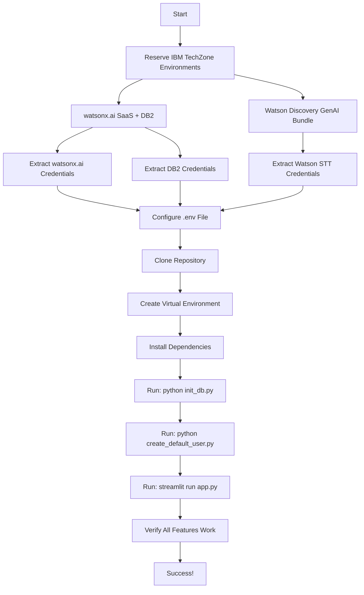

# Budget App Modularization - Implementation Plan

## Overview
This document outlines the complete plan to modularize the budget application for easy deployment by others. The goal is to enable users to clone the repo, add their IBM credentials, and run the application with minimal setup friction.

---

## 1. Simplified Category Structure

### New Default Categories (10 categories)
Replace the current 23 personal categories with these universal categories:

```python
categories = [
    ("Housing", 3000.00),              # Mortgage/Rent, HOA, Property Tax
    ("Utilities", 300.00),             # Electric, Water, Gas, Internet, Phone
    ("Transportation", 400.00),        # Gas, Car Insurance, Maintenance
    ("Groceries", 600.00),             # All grocery shopping
    ("Dining Out", 150.00),            # Restaurants, Coffee, Fast Food
    ("Healthcare", 150.00),            # Medical, Dental, Vision, Prescriptions
    ("Personal Care", 100.00),         # Toiletries, Cleaning, Gym
    ("Entertainment", 100.00),         # Subscriptions, Hobbies, Activities
    ("Debt & Savings", 700.00),        # Debt Payments, Savings, Investments
    ("Miscellaneous", 100.00),         # Gifts, Pet Care, Other
]
```

**Total Monthly Budget: $5,600**

### Benefits
- Universal categories work for most households
- Reduced from 23 to 10 categories (simpler)
- Users can add custom categories via app UI
- Vendor/notes fields provide additional detail

---

## 2. Files Requiring Changes

### 2.1 Files to Modify

| File | Changes Required | Priority |
|------|------------------|----------|
| `.env` | Remove credentials, add detailed comments | HIGH |
| `.env.example` | Add comprehensive inline comments | HIGH |
| `schema.sql` | Update seed categories to new 10 categories | HIGH |
| `utils/receipt_parser.py` | Update categorization rules and examples | HIGH |
| `utils/charts.py` | Remove Mortgage-specific logic | MEDIUM |
| `app.py` | Update placeholder text example | LOW |
| `create_default_user.py` | Remove hardcoded path | MEDIUM |
| `README.md` | Reference SETUP.md, update tech stack | HIGH |
| `SETUP.md` | Create comprehensive setup guide | HIGH |

### 2.2 Files to Delete

| File | Reason |
|------|--------|
| `add_categories.py` | No longer needed - categories seeded in schema.sql |

---

## 3. Detailed File Changes

### 3.1 `.env` File
**Current State:** Contains actual credentials
**Required Changes:**
- Remove all actual credential values
- Replace with empty strings
- Add detailed comments explaining where to get each credential

**New Content:**
```bash
# =============================================================================
# IBM watsonx.ai Configuration
# =============================================================================
# Get these credentials from IBM TechZone reservation:
# "watsonx.ai/.governance SaaS" (select YES to install DB2)
# 
# To find your API key:
# 1. Log into IBM Cloud: https://cloud.ibm.com
# 2. Navigate to: Manage > Access (IAM) > API keys
# 3. Create new API key or use existing one
# 4. Copy the API key value
#
# To find your Project ID:
# 1. Go to watsonx.ai: https://dataplatform.cloud.ibm.com/wx/home
# 2. Open your project
# 3. Click "Manage" tab > "General"
# 4. Copy the "Project ID"

WATSONX_API_KEY=""           # Example: "abc123XYZ456..."
WATSONX_PROJECT_ID=""        # Example: "13b9a563-0d40-4566-854a-44afa2988133"

# =============================================================================
# IBM Db2 Configuration
# =============================================================================
# Get these credentials from the same watsonx.ai TechZone reservation
# (DB2 is included when you select YES during reservation)
#
# To find DB2 credentials:
# 1. Log into IBM Cloud: https://cloud.ibm.com
# 2. Navigate to: Resource list > Services > Databases
# 3. Click your Db2 instance
# 4. Click "Service credentials" in left sidebar
# 5. If no credentials exist, click "New credential"
# 6. Click "View credentials" and copy the values below

DB2_DATABASE="bludb"         # Usually "bludb" (default, rarely changes)
DB2_HOSTNAME=""              # Example: "b1bc1829-6f45-4cd4.databases.appdomain.cloud"
DB2_PORT=""                  # Example: "32304" or "50001"
DB2_UID=""                   # Example: "xbx18098"
DB2_PWD=""                   # Example: "f9ReOC94gA6lo1GF"
DB2_SECURITY="SSL"           # Keep as "SSL" (do not change)

# =============================================================================
# IBM Watson Speech to Text Configuration
# =============================================================================
# Get these credentials from IBM TechZone reservation:
# "Watson Discovery GenAI bundle w/StudentID"
#
# To find Speech to Text credentials:
# 1. Log into IBM Cloud: https://cloud.ibm.com
# 2. Navigate to: Resource list > Services > AI / Machine Learning
# 3. Click your "Speech to Text" instance
# 4. Click "Service credentials" in left sidebar
# 5. If no credentials exist, click "New credential"
# 6. Click "View credentials" and copy the values below

SPEECH_TO_TEXT_API_KEY=""    # Example: "0jBO5BlxbkG6X9rymhGbpo-D8jAxEIxQxEw994wfEMnK"
SPEECH_TO_TEXT_URL=""        # Example: "https://api.us-south.speech-to-text.watson.cloud.ibm.com/instances/..."
                             # Note: URL varies by region (us-south, eu-gb, au-syd, etc.)
```

### 3.2 `.env.example` File
**Current State:** Has empty values with minimal comments
**Required Changes:**
- Match the structure and comments from the new `.env` file above
- Ensure it's identical to `.env` but with no actual credentials

### 3.3 `schema.sql`
**Current State:** Has 8 seed categories
**Required Changes:**
- Replace lines 43-51 with new 10 universal categories

**Old Seed Data (lines 43-51):**
```sql
-- Seed Categories
INSERT INTO categories (name, planned_amount) VALUES
('Grocery (Costco)', 500),
('Grocery (Aldi)', 300),
('Eating Out', 200),
('Gas', 150),
('Rent', 1500),
('Utilities', 200),
('Entertainment', 100),
('Miscellaneous', 100);
```

**New Seed Data:**
```sql
-- Seed Categories (Default budget categories for new installations)
INSERT INTO categories (name, planned_amount) VALUES
('Housing', 3000.00),
('Utilities', 300.00),
('Transportation', 400.00),
('Groceries', 600.00),
('Dining Out', 150.00),
('Healthcare', 150.00),
('Personal Care', 100.00),
('Entertainment', 100.00),
('Debt & Savings', 700.00),
('Miscellaneous', 100.00);
```

### 3.4 `utils/receipt_parser.py`
**Current State:** Has hardcoded category examples and rules (lines 105-110)
**Required Changes:**
- Update categorization rules to reference new universal categories
- Update examples to be more generic

**Old Content (lines 105-110):**
```python
Categorization Rules:
- 'HOA', 'Mortgage', 'Utilities', 'Insurance', 'Debt' are for monthly BILLS only, NOT store items
- Food/drink: use 'Grocery', or 'Eating Out'
- Paper towels (Kirkland Signature Towel), soap, cleaning: use 'Toiletries, Cleaning Supplies'
- Vitamins/supplements: use 'Supplemental'
- If unsure: use 'Misc.' or 'Personal'
```

**New Content:**
```python
Categorization Rules:
- 'Housing', 'Utilities', 'Debt & Savings' are for monthly BILLS only, NOT store items
- Food/drink from stores: use 'Groceries'
- Food/drink from restaurants: use 'Dining Out'
- Cleaning supplies, toiletries, hygiene products: use 'Personal Care'
- Vitamins, supplements, prescriptions: use 'Healthcare'
- Gas, car maintenance, insurance: use 'Transportation'
- If unsure: use 'Miscellaneous'
```

### 3.5 `utils/charts.py`
**Current State:** Has hardcoded logic to skip "Mortgage" category (lines 18-20)
**Required Changes:**
- Remove Mortgage-specific logic
- Make it generic to skip any category over a certain threshold (optional)
- OR remove the skip logic entirely since "Housing" is more reasonable

**Option 1: Remove skip logic entirely (RECOMMENDED)**
```python
for cat in categories_data:
    cat_name = cat['name']
    planned = float(cat['planned_amount'])
    actual = category_spending[category_spending['category'] == cat_name]['amount'].sum() if cat_name in category_spending['category'].values else 0
    
    category_names.append(cat_name)
```

**Option 2: Make it generic (skip categories over $2000)**
```python
for cat in categories_data:
    cat_name = cat['name']
    planned = float(cat['planned_amount'])
    
    # Skip very large categories to prevent scale skewing
    if planned > 2000:
        continue
        
    actual = category_spending[category_spending['category'] == cat_name]['amount'].sum() if cat_name in category_spending['category'].values else 0
    
    category_names.append(cat_name)
```

**Recommendation:** Use Option 1 (remove skip logic) since Housing at $3000 is reasonable to show.

### 3.6 `app.py`
**Current State:** Has placeholder text referencing "Costco" (line 352)
**Required Changes:**
- Update placeholder to be more generic

**Old Content (line 352):**
```python
placeholder="e.g., 20 at Costco for groceries and 15 for toiletries",
```

**New Content:**
```python
placeholder="e.g., 50 at grocery store and 20 at gas station",
```

### 3.7 `create_default_user.py`
**Current State:** Has hardcoded path (lines 1-2)
**Required Changes:**
- Remove hardcoded path

**Old Content (lines 1-2):**
```python
import sys
sys.path.insert(0, '/Users/nickkyburz/Desktop/budget-app')
```

**New Content:**
```python
# No sys.path manipulation needed - run from project root
```

### 3.8 `README.md`
**Current State:** References Google Sheets, has basic setup
**Required Changes:**
- Add prominent link to SETUP.md at the top
- Remove Google Sheets references
- Update tech stack
- Simplify Quick Start to reference SETUP.md

**New Structure:**
```markdown
# Budget App

> 🚀 **New User?** See [SETUP.md](SETUP.md) for complete setup instructions including IBM TechZone reservations and credential configuration.

A private budget-tracking mobile-friendly app using Streamlit, IBM watsonx.ai, Watson Speech-to-Text, and IBM Db2.

## Features

- 📊 **Monthly Dashboard** with spending charts and progress tracking
- 🤖 **AI-Powered Categorization** - Natural language expense parsing
- 🎤 **Voice Input** - Speak your expenses hands-free
- 📸 **Receipt Scanning** - Upload photos for automatic parsing
- 📱 **Mobile-Friendly** - Works great on phones
- 🗓️ **Monthly Tracking** - Organized by month with summaries
- ✏️ **Manage Categories** - Add, edit, delete budget categories

### 📸 Receipt Scanning
- **Visual Recognition**: Upload photos or take pictures of receipts
- **AI Parsing**: Uses Llama 3.2 Vision to extract line items and prices
- **Smart Categorization**: Automatically maps items to budget categories
- **HEIC Support**: Works with iPhone photos

### 🤖 AI-Powered Features
- **Natural Language**: "20 at Target for groceries and 15 for gas"
- **Multiple Expenses**: Parse several expenses at once
- **Voice Input**: Speak expenses using Watson Speech to Text
- **Smart Categories**: AI understands context and categorizes correctly

## Quick Start

**Prerequisites:**
- Python 3.8+
- IBM Cloud account (free tier available)
- Access to IBM TechZone

**Setup Steps:**
1. Reserve IBM TechZone environments (watsonx.ai + Watson STT)
2. Extract credentials from IBM Cloud
3. Clone this repository
4. Configure `.env` file with your credentials
5. Initialize database
6. Run the app

📖 **See [SETUP.md](SETUP.md) for detailed step-by-step instructions.**

## Tech Stack

- **Frontend**: Streamlit
- **Database**: IBM Db2 on Cloud
- **AI (Text)**: IBM watsonx.ai (Llama 3.3 70B)
- **AI (Vision)**: IBM watsonx.ai (Llama 3.2 90B Vision)
- **Speech**: IBM Watson Speech to Text
- **Charts**: Plotly

## Documentation

- [SETUP.md](SETUP.md) - Complete setup guide
- [IBM_TECHNOLOGY_OVERVIEW.md](IBM_TECHNOLOGY_OVERVIEW.md) - Technical details
- [DEPLOYMENT.md](DEPLOYMENT.md) - Streamlit Cloud deployment

## License

MIT
```

### 3.9 Delete `add_categories.py`
**Reason:** Categories are now seeded directly in `schema.sql`, making this script redundant.

---

## 4. New Documentation: SETUP.md

Create a comprehensive setup guide with the following sections:

### Structure Overview
```
SETUP.md
├── Prerequisites
├── Step 1: IBM TechZone Reservations
│   ├── Reservation 1: watsonx.ai SaaS (with DB2)
│   └── Reservation 2: Watson Discovery GenAI Bundle
├── Step 2: Extract Credentials
│   ├── watsonx.ai API Key & Project ID
│   ├── DB2 Credentials
│   └── Watson Speech to Text Credentials
├── Step 3: Local Development Setup
│   ├── Clone Repository
│   ├── Create Virtual Environment
│   ├── Install Dependencies
│   ├── Configure .env File
│   ├── Initialize Database
│   └── Run Application
├── Step 4: Verification
├── Troubleshooting
└── Optional: Streamlit Cloud Deployment
```

### 4.1 Prerequisites
```markdown
## Prerequisites

Before you begin, ensure you have:

- **Python 3.8 or higher** installed
  - Check: `python3 --version`
  - Download: https://www.python.org/downloads/

- **Git** installed
  - Check: `git --version`
  - Download: https://git-scm.com/downloads

- **IBM Cloud Account** (free tier available)
  - Sign up: https://cloud.ibm.com/registration

- **IBM TechZone Access**
  - Required for reserving IBM services
  - Access: https://techzone.ibm.com
```

### 4.2 IBM TechZone Reservations

```markdown
## Step 1: IBM TechZone Reservations

You need to reserve TWO environments from IBM TechZone:

### Reservation 1: watsonx.ai SaaS (with DB2)

**Purpose:** Provides watsonx.ai API and DB2 database

**Steps:**
1. Go to: https://techzone.ibm.com/collection/tech-zone-certified-base-images/journey-watsonx
2. Find: **"watsonx.ai/.governance SaaS"**
3. Click **"Reserve"**
4. ⚠️ **IMPORTANT:** Select **"Yes"** to install DB2 when prompted
5. Fill out reservation form:
   - **Purpose:** Education/Demo
   - **Duration:** Select appropriate timeframe (recommend 2+ weeks)
   - **Region:** Choose closest region
6. Submit reservation
7. Wait for email confirmation (usually 15-30 minutes)
8. Access your environment via the link in the email

**What you get:**
- watsonx.ai project with API access
- IBM Db2 database instance
- IBM Cloud account access

---

### Reservation 2: Watson Discovery GenAI Bundle

**Purpose:** Provides Watson Speech to Text API

**Steps:**
1. Go to: https://techzone.ibm.com/collection/tech-zone-certified-base-images/journey-watsonx
2. Find: **"Watson Discovery GenAI bundle w/StudentID"**
3. Click **"Reserve"**
4. Fill out reservation form:
   - **Purpose:** Education/Demo
   - **Duration:** Select appropriate timeframe
   - **Region:** Choose closest region
5. Submit reservation
6. Wait for email confirmation
7. Access your environment via the link in the email

**What you get:**
- Watson Speech to Text service
- Watson Discovery service (not used in this app)
```

### 4.3 Extract Credentials

```markdown
## Step 2: Extract Credentials

After your TechZone reservations are ready, extract the following credentials:

### 2.1 watsonx.ai API Key & Project ID

**API Key:**
1. Log into IBM Cloud: https://cloud.ibm.com
2. Click your profile icon (top right) → **Manage** → **Access (IAM)**
3. In left sidebar, click **API keys**
4. Click **Create** (or use existing key)
5. Give it a name (e.g., "Budget App Key")
6. Click **Create**
7. **Copy the API key** (you won't see it again!)
8. Save to `.env` as `WATSONX_API_KEY`

**Project ID:**
1. Go to watsonx.ai: https://dataplatform.cloud.ibm.com/wx/home
2. Click on your project (or create one if needed)
3. Click **"Manage"** tab at the top
4. Click **"General"** in left sidebar
5. Find **"Project ID"** section
6. **Copy the Project ID**
7. Save to `.env` as `WATSONX_PROJECT_ID`

---

### 2.2 DB2 Credentials

1. Log into IBM Cloud: https://cloud.ibm.com
2. Click **Navigation menu** (☰) → **Resource list**
3. Expand **"Services and software"** → **"Databases"**
4. Click your **Db2** instance
5. In left sidebar, click **"Service credentials"**
6. If no credentials exist:
   - Click **"New credential"**
   - Give it a name (e.g., "Budget App Credentials")
   - Click **"Add"**
7. Click **"View credentials"** (expand the credential)
8. Copy the following values to your `.env` file:

| JSON Field | .env Variable | Example |
|------------|---------------|---------|
| `database` | `DB2_DATABASE` | `bludb` |
| `hostname` | `DB2_HOSTNAME` | `b1bc1829-6f45-4cd4.databases.appdomain.cloud` |
| `port` | `DB2_PORT` | `32304` |
| `username` | `DB2_UID` | `xbx18098` |
| `password` | `DB2_PWD` | `f9ReOC94gA6lo1GF` |

**Note:** `DB2_SECURITY` should always be `"SSL"` (already set in `.env.example`)

---

### 2.3 Watson Speech to Text Credentials

1. Log into IBM Cloud: https://cloud.ibm.com
2. Click **Navigation menu** (☰) → **Resource list**
3. Expand **"Services and software"** → **"AI / Machine Learning"**
4. Click your **"Speech to Text"** instance
5. In left sidebar, click **"Service credentials"**
6. If no credentials exist:
   - Click **"New credential"**
   - Give it a name (e.g., "Budget App STT")
   - Click **"Add"**
7. Click **"View credentials"** (expand the credential)
8. Copy the following values to your `.env` file:

| JSON Field | .env Variable | Example |
|------------|---------------|---------|
| `apikey` | `SPEECH_TO_TEXT_API_KEY` | `0jBO5BlxbkG6X9rymhGbpo-D8jAxEIxQxEw994wfEMnK` |
| `url` | `SPEECH_TO_TEXT_URL` | `https://api.us-south.speech-to-text.watson.cloud.ibm.com/instances/...` |

**Note:** The URL varies by region (us-south, eu-gb, au-syd, etc.)
```

### 4.4 Local Development Setup

```markdown
## Step 3: Local Development Setup

### 3.1 Clone Repository

```bash
# Clone the repository
git clone https://github.com/YOUR-USERNAME/budget-app-demo.git

# Navigate into the directory
cd budget-app-demo
```

---

### 3.2 Create Virtual Environment

```bash
# Create virtual environment
python3 -m venv venv

# Activate virtual environment
# On macOS/Linux:
source venv/bin/activate

# On Windows:
venv\Scripts\activate

# You should see (venv) in your terminal prompt
```

---

### 3.3 Install Dependencies

```bash
# Install all required packages
pip install -r requirements.txt

# This will install:
# - streamlit (web framework)
# - ibm-watsonx-ai (AI models)
# - ibm-watson (speech to text)
# - ibm_db (database driver)
# - pandas, plotly (data & charts)
# - and other dependencies
```

**Note:** On macOS, if you encounter issues with `ibm_db`, you may need to install GCC:
```bash
brew install gcc
```

---

### 3.4 Configure .env File

```bash
# Copy the example file
cp .env.example .env

# Edit the .env file with your credentials
# Use your favorite text editor:
nano .env
# or
code .env  # VS Code
# or
vim .env
```

**Fill in ALL the credentials you collected in Step 2:**

```bash
WATSONX_API_KEY="your-api-key-here"
WATSONX_PROJECT_ID="your-project-id-here"

DB2_DATABASE="bludb"
DB2_HOSTNAME="your-hostname.databases.appdomain.cloud"
DB2_PORT="32304"
DB2_UID="your-username"
DB2_PWD="your-password"
DB2_SECURITY="SSL"

SPEECH_TO_TEXT_API_KEY="your-stt-api-key"
SPEECH_TO_TEXT_URL="https://api.us-south.speech-to-text.watson.cloud.ibm.com/instances/..."
```

**⚠️ Important:** Make sure there are NO spaces around the `=` sign and values are in quotes.

---

### 3.5 Initialize Database

Run these commands in order:

```bash
# 1. Create database schema and tables
python init_db.py
```

**Expected output:**
```
Connected to Db2.
Executing: CREATE TABLE users...
Success.
Executing: CREATE TABLE categories...
Success.
Executing: CREATE TABLE transactions...
Success.
Executing: CREATE TABLE categorization_rules...
Success.
Executing: INSERT INTO categories...
Success.
Database initialization complete.
```

```bash
# 2. Create default user
python create_default_user.py
```

**Expected output:**
```
Connected to Db2
Creating default user...
✓ Default user created successfully!

All users in database:
  - ID: default-user-001, Email: default@budgetapp.local
```

**Note:** The default categories are automatically created by `init_db.py` (from `schema.sql`), so you don't need to run a separate script for categories.

---

### 3.6 Run Application

```bash
# Start the Streamlit app
streamlit run app.py
```

**Expected output:**
```
  You can now view your Streamlit app in your browser.

  Local URL: http://localhost:8501
  Network URL: http://192.168.1.x:8501
```

The app will automatically open in your default browser at `http://localhost:8501`

**🎉 Success!** Your budget app is now running locally.
```

### 4.5 Verification Steps

```markdown
## Step 4: Verification

Test each feature to ensure everything is working:

### ✅ Test 1: Database Connection
1. App should load without errors
2. Go to **"Dashboard"** page
3. Should show "No transactions yet" (if fresh install)
4. Go to **"Manage Categories"** page
5. Should show 10 default categories:
   - Housing ($3,000)
   - Utilities ($300)
   - Transportation ($400)
   - Groceries ($600)
   - Dining Out ($150)
   - Healthcare ($150)
   - Personal Care ($100)
   - Entertainment ($100)
   - Debt & Savings ($700)
   - Miscellaneous ($100)

---

### ✅ Test 2: AI Text Parsing
1. Go to **"Add Expense"** page
2. Click **"AI Input"** tab
3. In the text box, type: `50 at grocery store for food`
4. Click **"Parse with AI"**
5. Should parse correctly:
   - Amount: 50
   - Vendor: grocery store
   - Category: Groceries
   - Notes: food
6. Click **"Save All"**
7. Go to **"Dashboard"** - expense should appear

---

### ✅ Test 3: Voice Input
1. Go to **"Add Expense"** → **"AI Input"** tab
2. Click **"🎤 Start"** button
3. Speak clearly: "Twenty dollars at the gas station"
4. Click **"⏹️ Stop"** button
5. Click **"📝 Transcribe & Parse"**
6. Should transcribe your speech and parse the expense
7. Verify the parsed data is correct
8. Click **"Save All"**

---

### ✅ Test 4: Receipt Upload
1. Go to **"Add Expense"** → **"Receipt Upload"** tab
2. Upload a receipt image (or take a photo)
3. Click **"Parse Receipt"**
4. Should extract:
   - Individual items with prices
   - Categories for each item
   - Tax amount
   - Total amount
5. Review the parsed items
6. Click **"Save All Expenses"**

---

### ✅ Test 5: Category Management
1. Go to **"Manage Categories"** page
2. Try adding a new category:
   - Click **"Add New Category"**
   - Name: "Test Category"
   - Amount: 50
   - Click **"Add Category"**
3. Should appear in the list
4. Try editing it:
   - Click **"Edit"** next to "Test Category"
   - Change amount to 75
   - Click **"Update"**
5. Try deleting it:
   - Click **"Delete"** next to "Test Category"
   - Confirm deletion

**If all tests pass, your setup is complete! 🎉**
```

### 4.6 Troubleshooting

```markdown
## Troubleshooting

### Issue: Database Connection Failed

**Error message:**
```
Error connecting to Database: [IBM][CLI Driver] SQL30081N...
```

**Solutions:**
1. **Verify credentials in `.env`:**
   - Check for typos in hostname, username, password
   - Ensure no extra spaces around values
   - Verify port number is correct (usually 32304 or 50001)

2. **Check DB2 instance status:**
   - Log into IBM Cloud
   - Go to Resource list → Databases
   - Verify your Db2 instance is "Active"

3. **SSL Certificate issues:**
   - Delete `db2_ssl_cert.pem` if it exists
   - Restart the app (it will regenerate)

4. **Test connection directly:**
   ```bash
   python debug_db.py
   ```

---

### Issue: watsonx.ai API Errors

**Error message:**
```
Missing Watsonx credentials
```

**Solutions:**
1. **Verify API key:**
   - Log into IBM Cloud
   - Go to Manage → Access (IAM) → API keys
   - Verify your API key is active
   - Try creating a new API key

2. **Verify Project ID:**
   - Go to watsonx.ai
   - Open your project
   - Manage → General → Copy Project ID
   - Ensure it matches `.env`

3. **Check API key permissions:**
   - API key must have access to watsonx.ai service
   - May need "Editor" or "Writer" role

---

### Issue: Speech to Text Errors

**Error message:**
```
Error transcribing audio: Unauthorized
```

**Solutions:**
1. **Verify STT credentials:**
   - Log into IBM Cloud
   - Resource list → AI / Machine Learning → Speech to Text
   - Check service credentials
   - Verify API key and URL match `.env`

2. **Check service status:**
   - Ensure Speech to Text instance is "Active"
   - Try creating new service credentials

3. **Verify URL region:**
   - URL must match your service region
   - Examples:
     - US South: `https://api.us-south.speech-to-text.watson.cloud.ibm.com`
     - Sydney: `https://api.au-syd.speech-to-text.watson.cloud.ibm.com`
     - London: `https://api.eu-gb.speech-to-text.watson.cloud.ibm.com`

---

### Issue: Module Import Errors

**Error message:**
```
ModuleNotFoundError: No module named 'ibm_db'
```

**Solutions:**
1. **Ensure virtual environment is activated:**
   ```bash
   # You should see (venv) in your prompt
   source venv/bin/activate  # macOS/Linux
   venv\Scripts\activate     # Windows
   ```

2. **Reinstall dependencies:**
   ```bash
   pip install -r requirements.txt
   ```

3. **macOS specific - install GCC:**
   ```bash
   brew install gcc
   pip install ibm_db
   ```

4. **Windows specific - install Visual C++:**
   - Download: https://visualstudio.microsoft.com/downloads/
   - Install "Build Tools for Visual Studio"

---

### Issue: Receipt Parsing Fails

**Error message:**
```
Error parsing receipt: Image too large
```

**Solutions:**
1. **Resize image before upload:**
   - Maximum size: 2048x2048 pixels
   - App auto-resizes, but very large images may timeout

2. **Check image format:**
   - Supported: JPG, PNG, HEIC (iPhone)
   - If HEIC fails, convert to JPG first

3. **Verify watsonx.ai vision model access:**
   - Ensure your project has access to Llama 3.2 90B Vision
   - Check project settings in watsonx.ai

---

### Issue: App Won't Start

**Error message:**
```
streamlit: command not found
```

**Solutions:**
1. **Activate virtual environment:**
   ```bash
   source venv/bin/activate  # macOS/Linux
   venv\Scripts\activate     # Windows
   ```

2. **Reinstall Streamlit:**
   ```bash
   pip install streamlit
   ```

3. **Check Python version:**
   ```bash
   python3 --version  # Should be 3.8 or higher
   ```

---

### Still Having Issues?

1. **Check all credentials are correct** in `.env`
2. **Verify IBM Cloud services are active**
3. **Try running in a fresh virtual environment**
4. **Check firewall/proxy settings** (may block IBM Cloud connections)
5. **Review error logs** in terminal for specific error messages

**Common mistakes:**
- ❌ Forgot to activate virtual environment
- ❌ Typos in `.env` file
- ❌ Using wrong region URL for services
- ❌ API key doesn't have proper permissions
- ❌ DB2 instance is stopped/inactive
```

### 4.7 Optional Deployment

```markdown
## Optional: Deploy to Streamlit Cloud

Want to access your budget app from anywhere? Deploy to Streamlit Cloud:

### Prerequisites
- GitHub account
- Your code pushed to a GitHub repository

### Steps

1. **Push code to GitHub:**
   ```bash
   git add .
   git commit -m "Initial commit"
   git push origin main
   ```

2. **Go to Streamlit Cloud:**
   - Visit: https://share.streamlit.io
   - Sign in with GitHub

3. **Deploy app:**
   - Click **"New app"**
   - Select your repository
   - Set main file path: `app.py`
   - Click **"Advanced settings"**

4. **Add secrets:**
   - Click **"Secrets"** section
   - Paste your credentials in TOML format:

   ```toml
   WATSONX_API_KEY = "your-api-key"
   WATSONX_PROJECT_ID = "your-project-id"
   
   DB2_DATABASE = "bludb"
   DB2_HOSTNAME = "your-hostname.databases.appdomain.cloud"
   DB2_PORT = "32304"
   DB2_UID = "your-username"
   DB2_PWD = "your-password"
   DB2_SECURITY = "SSL"
   
   SPEECH_TO_TEXT_API_KEY = "your-stt-key"
   SPEECH_TO_TEXT_URL = "https://api.us-south.speech-to-text.watson.cloud.ibm.com/instances/..."
   ```

5. **Deploy:**
   - Click **"Deploy"**
   - Wait for deployment (2-3 minutes)
   - Your app will be live at: `https://your-app-name.streamlit.app`

6. **Access on mobile:**
   - Open the URL on your phone
   - **iOS:** Safari → Share → "Add to Home Screen"
   - **Android:** Chrome → Menu → "Add to Home screen"

**Note:** Streamlit Cloud free tier includes:
- 1 GB RAM
- 1 CPU core
- Unlimited public apps
- Perfect for personal use
```

---

## 5. Implementation Checklist

### Phase 1: Clean Up Credentials ✅
- [ ] Update `.env` - remove actual credentials, add detailed comments
- [ ] Update `.env.example` - add detailed comments matching `.env`
- [ ] Verify `.gitignore` includes `.env`

### Phase 2: Update Category System ✅
- [ ] Update `schema.sql` - replace seed categories with 10 new universal categories
- [ ] Delete `add_categories.py` - no longer needed
- [ ] Update `utils/receipt_parser.py` - update categorization rules
- [ ] Update `utils/charts.py` - remove Mortgage-specific logic
- [ ] Update `app.py` - update placeholder text example
- [ ] Remove hardcoded path from `create_default_user.py`

### Phase 3: Create Documentation ✅
- [ ] Create `SETUP.md` - comprehensive setup guide with all sections above
- [ ] Update `README.md` - reference SETUP.md, update tech stack
- [ ] Verify all links work
- [ ] Ensure instructions are clear and complete

### Phase 4: Testing ✅
- [ ] Test fresh installation following SETUP.md
- [ ] Verify all credentials work
- [ ] Test database initialization
- [ ] Test all app features (AI, voice, receipts)
- [ ] Fix any issues found

### Phase 5: Final Review ✅
- [ ] Review all documentation for clarity
- [ ] Ensure no personal information remains in any files
- [ ] Test on clean environment (fresh clone)
- [ ] Ready for distribution

---

## 6. Success Criteria

The modularization is complete when a new user can:

1. ✅ Clone the repository
2. ✅ Follow SETUP.md to reserve IBM TechZone environments
3. ✅ Extract credentials from IBM Cloud
4. ✅ Configure `.env` file
5. ✅ Run 2 commands to initialize database:
   - `python init_db.py`
   - `python create_default_user.py`
6. ✅ Run `streamlit run app.py` and have a working app
7. ✅ Use all features (AI parsing, voice input, receipt scanning)
8. ✅ Find help in troubleshooting section if issues arise
9. ✅ Optionally deploy to Streamlit Cloud

**No personal information should remain in the repository.**

---

## 7. Files Summary

### Files to Modify

| File | Priority | Changes |
|------|----------|---------|
| `.env` | HIGH | Remove credentials, add detailed comments |
| `.env.example` | HIGH | Add detailed comments |
| `schema.sql` | HIGH | Update seed categories (10 new categories) |
| `utils/receipt_parser.py` | HIGH | Update categorization rules |
| `utils/charts.py` | MEDIUM | Remove Mortgage-specific logic |
| `app.py` | LOW | Update placeholder text |
| `create_default_user.py` | MEDIUM | Remove hardcoded path |
| `README.md` | HIGH | Reference SETUP.md, update tech stack |

### Files to Create

| File | Priority | Purpose |
|------|----------|---------|
| `SETUP.md` | HIGH | Comprehensive setup guide |

### Files to Delete

| File | Reason |
|------|--------|
| `add_categories.py` | Categories now seeded in schema.sql |

---

## 8. Setup Flow Diagram



---

## 9. Next Steps

Once this plan is approved:

1. **Switch to Code mode** to implement changes
2. **Implement changes file by file** following this plan
3. **Test each change** before moving to the next
4. **Create SETUP.md** with all detailed instructions
5. **Final testing** on a clean environment
6. **Ready for distribution** 🎉
